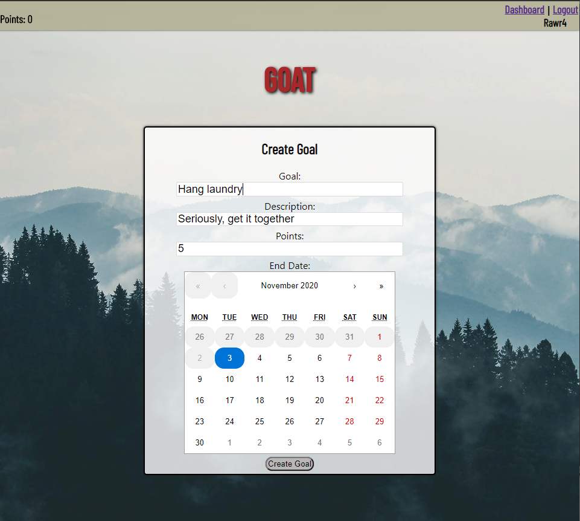
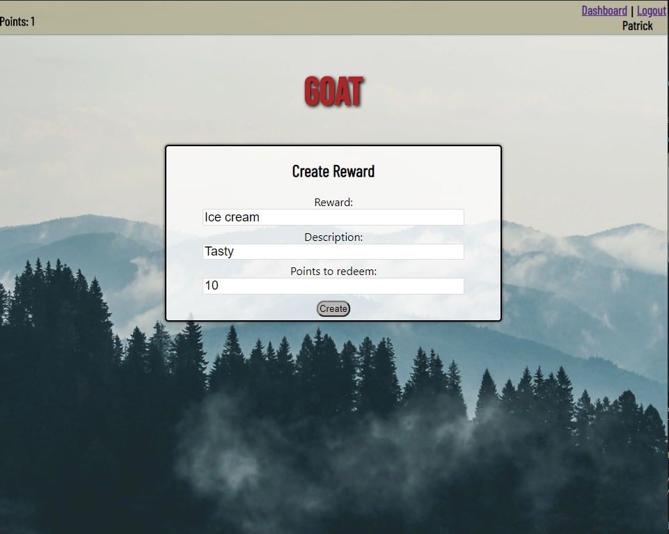
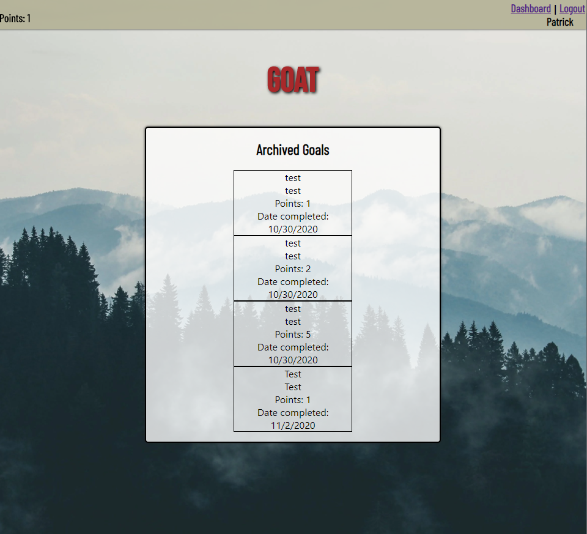

Goat
=========================================================================
GitHub Client: https://github.com/thinkful-ei-quail/goat-client

GitHub Server: https://github.com/thinkful-ei-quail/goat-api

Live Client: https://goat-client.vercel.app

Live Server: https://polar-springs-61352.herokuapp.com/

Developer Team:

Madison Brown, Project Manager

Patrick Easter, Co-Product Manager

Justin Foster, Design Lead

Matt Macomber, QA Lead

WHAT IS GOAT?
---------------------------------------------------------------------------

GOAT allows you to create personal goals in a gamified way! The user can add new goals, gambling points on getting them done by a set time.
Finishing the goal on time grants the points decided, while failing to accomplish it causes a loss of those points.
The user can also set rewards and associated point values. Once the user has enough points, they can redeem their rewards.

Creating a goal:

Creating a reward:

View past goals:

TECHNOLOGY
--------------------------------------------------------

Front End: React, Javascript, CSS, HTML

Back End: Javascript, Express, Knex

Data Persistance: PostgreSQL

Hosting: Vercel, Heroku

Dev Environment: Google DevOPs, Mocha and Chai

SAMPLE API CALLS AND RESPONSES
----------------------------------------------------------------

USER CREATION

Endpoint: API/User/Post

REQUEST {

password(HASHED): "**\*\***\*\*\***\*\***",

user_name: "new_user",

full_name: "Newton User",

nickname: "goal_lover_1"

}

RESPONSE

Code: 201

{
password(HASHED): "**\*\***\*\*\***\*\***",

user_name: "new_user",

full_name: "Newton User",

nickname: "goal_lover_1"

}

SECURE LOGIN(JWT-Auth)

Endpoint: API/Auth/Post

REQUEST {

password(HASHED): "**\*\***\*\*\***\*\***",

user_name: "new_user",

}

RESPONSE

Send: AuthToken

GOAL CREATION

Endpoint: API/Goals

REQUEST {

title: "Do a thing",

description: "This is a thing I will do if I try",

points: 100,

end_date: 3/1/2021,

}

RESPONSE

CODE: 201

{

title: "Do a thing",

description: "This is a thing I will do if I try",

points: 100,

end_date: 3/1/2021,

}

GOAL MODIFICATION

Endpoint: API/Goals

REQUEST {

id: 1

complete: true

archive: false

}

RESPONSE

CODE: 204

REWARD CREATION

Endpoint: API/Rewards

REQUEST {

title: "Ice cream",

description: "Tasty",

points: 100,

end_date: 3/1/2021,

}

RESPONSE

CODE: 201

{

title: "Ice cream",

description: "Tasty",

points: 100,

end_date: 3/1/2021,

}

REWARD DELETION

Endpoint: API/Rewards

REQUEST {

id: 1

}

RESPONSE

CODE: 204
